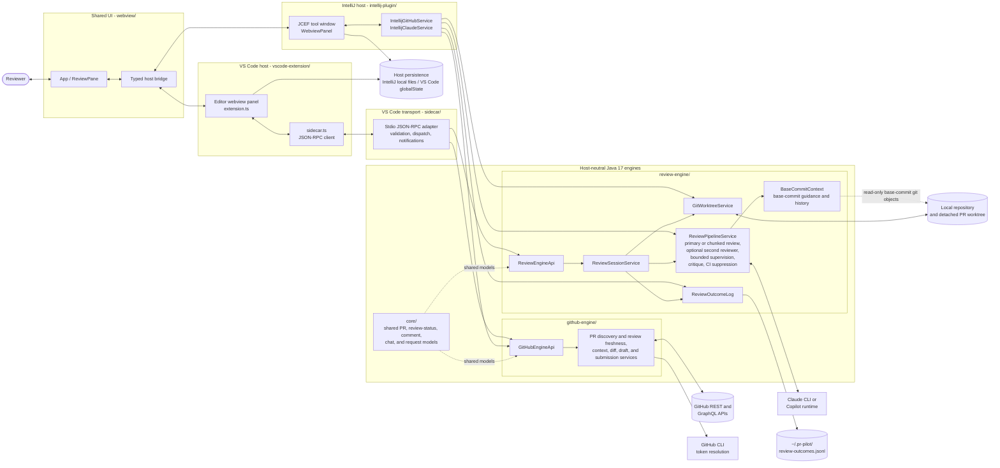
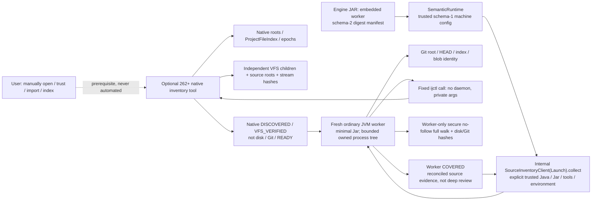
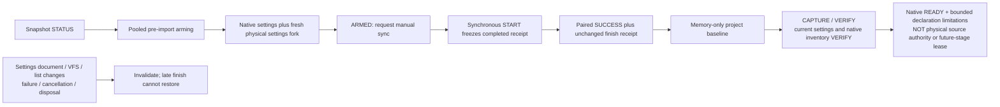
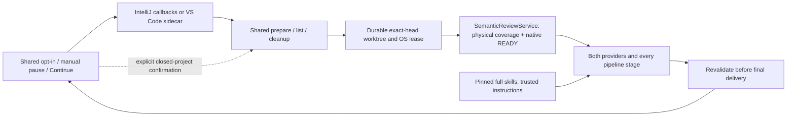

# PR Pilot Architecture

## Boundary rules

- `core`, `github-engine`, and `review-engine` own host-neutral behavior.
- IntelliJ consumes GitHub capabilities through `GitHubEngineApi` and calls review-engine services
  in-process. VS Code reaches both capability surfaces only through the sidecar.
- The shared webview owns the user workflow and communicates through the typed host bridge.
- GitHub credentials remain inside `github-engine`; hosts receive only token-free results.
- Provider processes, worktrees, prompts, parsing, supervision, and review semantics remain inside
  `review-engine`.
- Engine capabilities are declared once and exposed to every host; hosts may not reimplement them.
# Semantic collection authorities

The shared `SemanticReviewService` consumes this physical coverage before authorizing either
host/provider's deep pipeline. Library/SDK roots are metadata; external module
sources block. Native readiness is a separate tool below;
collection, provider-stage and delivery checks remain separate gates. Ordinary 261/MCP-absent
loading stays independent.

Production observations come from the strict real-platform adapter. Tests substitute raw
`NativeAccess` observations, not these states or results, and drain queued arm/finish work.
Successful service-entry tests are distinct from real-262 tracker/import/timing evidence.

No provider runs during manual setup. The engine keeps the lease through final delivery;
cancellation releases execution but preserves retention. Cleanup rejects active, dirty or
uncertain trees and never forces removal. Installed-host/provider matrices and native lifecycle
controls remain execution evidence, not conclusions inferred from this diagram or archive tests.
